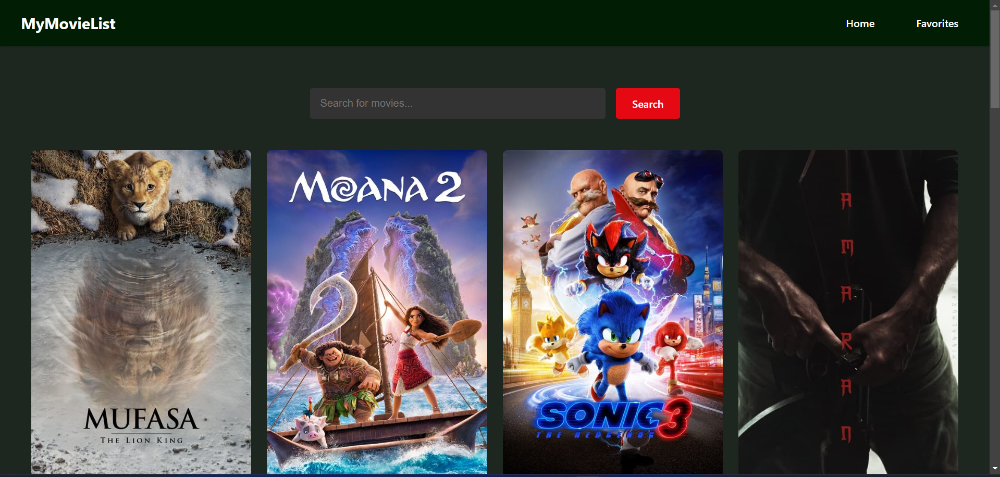
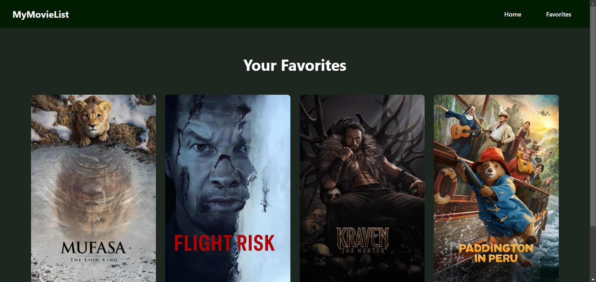

# Movie Browser 🚀

A simple React project built with Vite to help you browse movies and store your favorites

## Features
✅ React Router for navigation  
✅ State management with useState & useEffect  
✅ Reusable components  
✅ Styled with CSS  

## Screenshots  
### 🏠 Home Page  
  

### ⭐ Favorites Page  
  

## Project Structure  
```
/src
 ├── components/     # Reusable UI components
 ├── pages/          # Home and Favorites pages
 ├── App.jsx         # Main App component
 ├── main.jsx        # Entry point
```
